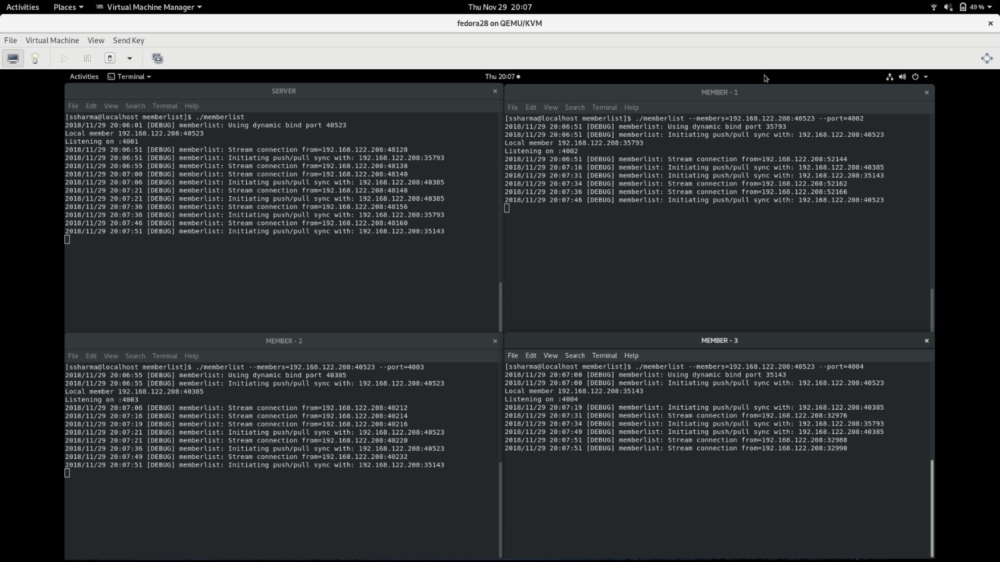
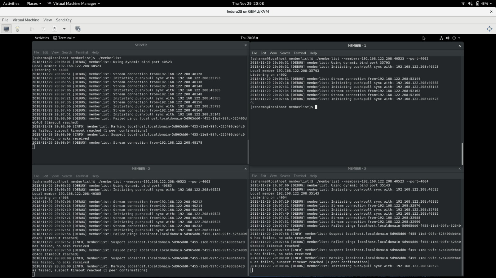

# Cmpe273-Research-Paper-Shareout
Material for Cmpe273 Research Paper Presentation

## SWIM (Scalable Weakly-consistent Infection-style Process Group Membership Protocol)

## Team Members:

S.no | Name | Email | Student Id |
--- | --- | --- | --- |
 1 | Aditya Chouhan  | <aditya.chouhan@sjsu.edu> | 012540437 |
 2 | Anshul Patni | <anshul.patni@sjsu.edu> | 012415156 |
 3 | Sahil Sharma | <sahil.sharma@sjsu.edu> | 012169404 |
 4 | Varun Upadhyay | <varun.upadhyay@sjsu.edu> | 011862422 |

We have referenced the following blog article to understand the research paper
[SWIM: The scalable membership protocol](https://www.brianstorti.com/swim/)

For demo we have referenced the Hashicorp's implementation of the SWIM protocol in Golang programming language.

## Repository Link:
* [SWIM Membership Protocol](https://github.com/hashicorp/memberlist)
* [Memberlist: A Simple Implementation of SWIM Membership Protocol](https://github.com/asim/memberlist)

## Demo Screenshots

#### Connecting to the servers

#### One member leaving the cluster

